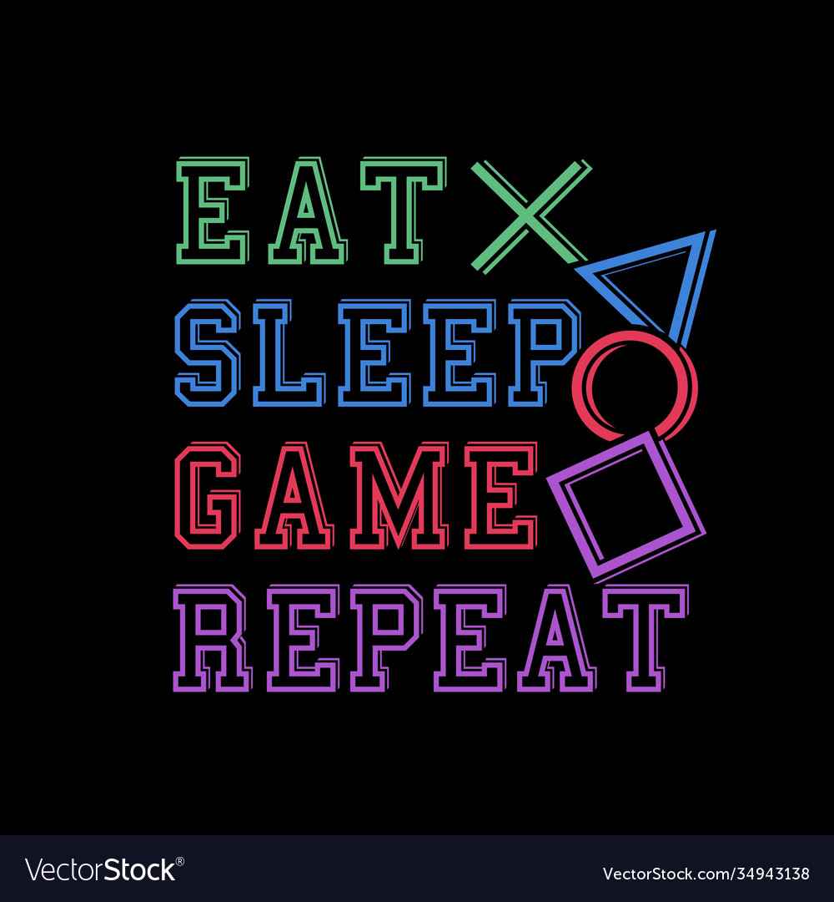

<!DOCTYPE html>
<html lang="en">

<head>
    <meta charset="UTF-8"> <!-- dit en hieronder zijn meta tags zodat de website op zoveel mogelijk browsers er goed uit ziet -->
    <meta http-equiv="X-UA-Compatible" content="IE=edge">
    <meta name="viewport" content="width=device-width, initial-scale=1.0">
    <title>Deelvraag 1</title>

    <link href="main.css" rel="stylesheet">
</head>

<body>

 <table>
        <tr><td>‏‏‎ ‎‏‏‎ ‎</td></tr>
        <tr>
            <td id=celA>Bij een gameverslaving spreek je van een persoon die zo geobsedeerd is door het spelen van een computerspel dat alles anders minder belangrijk is. 
         Veel raken verslaafd een en spel op zich, terwijl anderen verslaafd raken en het gevoel van winnen. 
          Hierdoor verwaarlozen veel verslaafden hun basisbehoeften zoals eten en slapen, wat leidt tot gezondheidsproblemen en sociale problemen. 
           Een gameverslaafde heeft (bijna) geen aandacht meer voor persoonlijke contacten zowel op school, thuis of op het werk. 
            Hierdoor raakt een verslaafde vaak sociaal geïsoleerd.</td>
                 <td class=ov></src></td>
                        </tr>
                        <tr>
                           <td>  En bij spellen waar je kunt betalen om beter te worden, kan een gameverslaving uiteindelijk ontwikkelen tot een gokverslaving. 
                            Daarnaast gaan veel verslaafden vaak ook alcohol of drugs gebruiken om hun sociale problemen te onderdrukken of om langer door te kunnen gaan online. 
                             Gameverslaving komt met name voor bij jongeren onder de 25 jaar.
                             <td class=ov></src></td>                          
                        </tr>
                        <tr>
                            <td>Het effect van een gameverslaving is groter dan je eerst misschien had verwacht. Bij deze deelvraag behandelen we de effecten van obsessief gamen.</td>
                        
                              
                             
                              <a href="https://pwsmtlm.itch.io/pwsmtlm" target="_blank"><u>Link</u></a></td>
                            <td class=ov></src></td>
                        </tr>
    </table>
